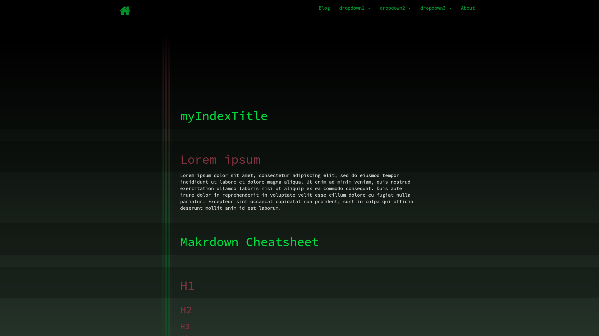

# Introduction

목표와 계획을 중요시하며, 변화를 받아들일 준비가 되어있고 성장의 욕구가 크며, 좋은 개발자이기 전에 좋은 사람이 되려고 노력합니다.
유지보수성과 확장성이 좋은 소프트웨어를 만들어내는 것에 관심이 있으며, 클린 코드 및 글쓰기에 관심이 있습니다.

# [Career](#)

## (주)메이아이

- 입사일 : 2019.07.01
- 퇴사일 : present
- 담당 업무 : 신규 웹 홈페이지 구축

첫 회사에 입사 당시 스프링에 대한 이해가 많이 부족한 상태에서 입사해서 많은 노력 끝에 현재는 개발 팀 내에서 자바, 스프링 관련 지식들을 공부 후 전파하고있으며 프로젝트의 메인 개발자로 투입되고 있습니다. 입사 후 `Swagger 를 통한 API 문서화 도입` 및 `커밋 메시지 규칙 도입`을 하였으며, 회사내 개발팀에서 문서화 부족으로 인한 불편함을 겪고있어서 `신입 교육 자료 및 각종 정보 등에 대한 문서화`를 정착시켰습니다.

# [Education](#)

## 우송정보대학

- 전공 : 컴퓨터 정보학과
- 학점 : 4.49

## 천안중앙고등학교

- 이과

# [Projects](#)

|프로젝트 명|기간|개발환경|담당업무|
|----------|----|-------|-------|
|**일제강제동원<br/>피해자지원재단<br/>신규 구축**|2021-03-02~<br/>2021-05-10|IntelliJ, Spring Boot 1.5.4<br/>JDK 1.8, JSP, Javascript, MySQL|- 프로젝트 메인 개발자로 투입<br/>- 사수로서 신입 교육 및 양성<br />- 게시판 및 프로그램 개발|
|**소상공인<br/>지식나눔터<br/>신규 구축**|2020-12-15~<br/>2021-03-01|IntelliJ, Spring Boot 1.5.4<br/>JDK 1.7, JSP, Javascript, Oracle|- 프로젝트 메인 개발자로 투입<br/>- API 문서화를 위해 Swagger 도입<br/>- 전체적인 테이블 설계<br/>- 동영상 관리<br />- 더보기 모듈 개발<br/>- 관리자 채널 관리<br/>- 통계<br/>- 통합검색(채널,영상 추가)|
|**여성인재<br/>데이터베이스<br/>신규 구축**|2020-11-15~<br/>2020-12-31|IntelliJ, Spring Boot 1.5.4<br/>JDK 1.8, JSP, Javascript, Oracle|- 직종 관리<br/>- 전문분야 관리<br />- 회원 관리<br/>- 통계|
|**수자원공사<br/>단비톡톡<br/>추가기능개발**|2020-10-11~<br/>2020-11-15|IntelliJ, Spring 4.0.9<br/>JDK 1.7, JSP, Javascript, Oracle|- 프로젝트 메인 개발자로 투입<br/>- 회원관리<br/>- 마일리지 적립/차감 개발 시<br />역할, 책임, 협력으로 구분<br />전략 패턴을 적용해서 개발<br />- 엑셀 데이터 업로드<br/>- 마일리지 상품구매<br/>- 알림(SMS, EMAIL)<br/>- 본인인증<br/>- 통계<br/>- SSO연계<br/>- DataBase Migration|
|**CMS 리팩터링**|2020-05-21~<br/>2020-06-04|IntelliJ, Spring Boot 1.5.4<br/>JDK 1.7, JSP, Javascript, MySQL|- 게시판 관리<br/>- 권한 관리<br />- 카테고리 관리<br/>- 팝업 관리|
|**디자인시안<br/>관리 프로그램<br/>신규 구축**|2020-10-01~<br/>2020-10-10|IntelliJ, Spring Boot 1.5.4<br/>JDK 1.8, JSP, Javascript, MySQL|- 프로젝트 메인 개발자로 투입<br/>- 디자인시안 관리<br/>- 설문 참여<br />- 통계|   
|**소상공인<br/>확인서발급시스템<br/>신규 구축**|2020-06-15~<br/>2020-09-31|IntelliJ, Spring Boot 1.5.4<br/>DK 1.8, JDK 1.6, JSP, Javascript, Oracle|- 프로젝트 메인 개발자로 투입<br/>- 내부DB와 로그인 연동<br/>- Jeus8 app 소스배포<br />- 개인정보이력 AOP<br/>- SMS AOP, Scheduler<br/>- 권한 처리<br/>- 엑셀다운로드<br/>- 본인인증<br/>- SSO연계<br/>- 반려이력<br/>- 유효기간연장이력 <br/>- 발급이력<br/>- 발급 통계 현황<br/>- 내부 공통사업관리 모듈 연계<br/>파일공통다운로드<br/>로그인인증이력|   
|**보령시청<br/>재난지원금신청<br/>신규 구축**|2020-04-20~<br/>2020-05-20|IntelliJ, Spring 3.0.5<br/>JDK 1.6, JSP, Javascript, Tibero|- 긴급재난지원금신청<br/>- 신청 통계|  
|**공주대학교<br/>홈페이지 개편**|2020-01-01~<br/>2020-04-10|IntelliJ, Spring Boot 1.5.4<br/>JDK 1.8, JSP, Javascript, Oracle|- 조직도 관리<br/>- 직원 관리<br/>- 교수 관리<br/>- 대용량파일첨부솔루션연계<br/>- 규정집/학칙 PDF 관리<br/>- 시설물 신청 관리<br/>- 무료버스 관리<br/>- 메인, 서브레이아웃 작업<br/>-DataBase Migration|      
|**한국조폐공사<br/>수정사항 처리**|2019-12-01~<br/>2029-12-31|IntelliJ, Spring Boot 1.5.4<br/>JDK 1.8, JSP, Javascript, Tibero|- 수정사항 처리|    
|**대전동구청<br/>홈페이지<br/>신규 구축**|2019-09-01~<br/>2029-12-31|IntelliJ, Spring Boot 1.5.4<br/>JDK 1.8, JSP, Javascript, MySQL|- 민원사무편람<br/>- 날씨,미세먼지 공공API<br/>- 사전정보공개<br/>- 정책실명제<br/>- 단체예약프로그램<br/>- 약수터안내<br/>- 예산서공개<br/>- 설문조사<br/>- 팝업 관리<br/>- 일정 관리<br/>- 크롤링을 통한 iframe 관리<br/>- DataBase Migration|     
|**CMS 관리**|2019-07-15~<br/>2019-08-31|IntelliJ, Spring Boot 1.5.4<br/>DK 1.7, JSP, Javascript, MySQL|- 설문조사 관리<br/>- 파일 관리<br />- 수정사항 처리|

1. First ordered list item
2. Another item
  * Unordered sub-list.
1. Actual numbers don't matter, just that it's a number
  1. Ordered sub-list
4. And another item.

   You can have properly indented paragraphs within list items. Notice the blank line above, and the leading spaces (at least one, but we'll use three here to also align the raw Markdown).

   To have a line break without a paragraph, you will need to use two trailing spaces.  
   Note that this line is separate, but within the same paragraph.  
   (This is contrary to the typical GFM line break behaviour, where trailing spaces are not required.)

* Unordered list can use asterisks
- Or minuses
+ Or pluses


[I'm an inline-style link](https://www.google.com)

[I'm an inline-style link with title](https://www.google.com "Google's Homepage")

[I'm a reference-style link][Arbitrary case-insensitive reference text]

[I'm a relative reference to a repository file](../blob/master/LICENSE)

[You can use numbers for reference-style link definitions][1]

Or leave it empty and use the [link text itself].

URLs and URLs in angle brackets will automatically get turned into links.
http://www.example.com or <http://www.example.com> and sometimes
example.com (but not on Github, for example).

Some text to show that the reference links can follow later.

[arbitrary case-insensitive reference text]: https://www.mozilla.org
[1]: http://slashdot.org
[link text itself]: http://www.reddit.com


Here's our logo (hover to see the title text):

Inline-style:


Reference-style:
![alt text][logo]

[logo]: https://github.com/adam-p/markdown-here/raw/master/src/common/images/icon48.png "Logo Title Text 2"

Large image



Inline `code` has `back-ticks around` it.

```javascript
var s = "JavaScript syntax highlighting";
alert(s);
```

```python
s = "Python syntax highlighting"
print s
```

```
No language indicated, so no syntax highlighting.
But let's throw in a <b>tag</b>.
```


Colons can be used to align columns.

| Tables        | Are           | Cool  |
| ------------- |:-------------:| -----:|
| col 3 is      | right-aligned | $1600 |
| col 2 is      | centered      |   $12 |
| zebra stripes | are neat      |    $1 |

There must be at least 3 dashes separating each header cell.
The outer pipes (|) are optional, and you don't need to make the
raw Markdown line up prettily. You can also use inline Markdown.


Markdown | Less | Pretty
--- | --- | ---
*Still* | `renders` | **nicely**
1 | 2 | 3


> Blockquotes are very handy in email to emulate reply text.
> This line is part of the same quote.

Quote break.

> This is a very long line that will still be quoted properly when it wraps. Oh boy let's keep writing to make sure this is long enough to actually wrap for everyone. Oh, you can *put* **Markdown** into a blockquote.


<dl>
  <dt>Definition list</dt>
  <dd>Is something people use sometimes.</dd>

  <dt>Markdown in HTML</dt>
  <dd>Does *not* work **very** well. Use HTML <em>tags</em>.</dd>
</dl>


Three or more...

---

Hyphens

***

Asterisks

___

Underscores


Here's a line for us to start with.

This line is separated from the one above by two newlines, so it will be a *separate paragraph*.

This line is also a separate paragraph, but...
This line is only separated by a single newline, so it's a separate line in the *same paragraph*.


# [Bootstrap Theme Example](https://getbootstrap.com/docs/3.3/examples/theme/)


<!-- Main jumbotron for a primary marketing message or call to action -->
<div class="jumbotron">
  <h1>Theme example</h1>
  <p>This is a template showcasing the optional theme stylesheet included in Bootstrap. Use it as a starting point to create something more unique by building on or modifying it.</p>
</div>


<h1>Buttons</h1>
<p>
  <button type="button" class="btn btn-lg btn-default">Default</button>
  <button type="button" class="btn btn-lg btn-primary">Primary</button>
  <button type="button" class="btn btn-lg btn-success">Success</button>
  <button type="button" class="btn btn-lg btn-info">Info</button>
  <button type="button" class="btn btn-lg btn-warning">Warning</button>
  <button type="button" class="btn btn-lg btn-danger">Danger</button>
  <button type="button" class="btn btn-lg btn-link">Link</button>
</p>
<p>
  <button type="button" class="btn btn-default">Default</button>
  <button type="button" class="btn btn-primary">Primary</button>
  <button type="button" class="btn btn-success">Success</button>
  <button type="button" class="btn btn-info">Info</button>
  <button type="button" class="btn btn-warning">Warning</button>
  <button type="button" class="btn btn-danger">Danger</button>
  <button type="button" class="btn btn-link">Link</button>
</p>
<p>
  <button type="button" class="btn btn-sm btn-default">Default</button>
  <button type="button" class="btn btn-sm btn-primary">Primary</button>
  <button type="button" class="btn btn-sm btn-success">Success</button>
  <button type="button" class="btn btn-sm btn-info">Info</button>
  <button type="button" class="btn btn-sm btn-warning">Warning</button>
  <button type="button" class="btn btn-sm btn-danger">Danger</button>
  <button type="button" class="btn btn-sm btn-link">Link</button>
</p>
<p>
  <button type="button" class="btn btn-xs btn-default">Default</button>
  <button type="button" class="btn btn-xs btn-primary">Primary</button>
  <button type="button" class="btn btn-xs btn-success">Success</button>
  <button type="button" class="btn btn-xs btn-info">Info</button>
  <button type="button" class="btn btn-xs btn-warning">Warning</button>
  <button type="button" class="btn btn-xs btn-danger">Danger</button>
  <button type="button" class="btn btn-xs btn-link">Link</button>
</p>


<h1>Tables</h1>
<div class="row">
  <div class="col-md-6">
    <table class="table">
      <thead>
        <tr>
          <th>#</th>
          <th>First Name</th>
          <th>Last Name</th>
          <th>Username</th>
        </tr>
      </thead>
      <tbody>
        <tr>
          <td>1</td>
          <td>Mark</td>
          <td>Otto</td>
          <td>@mdo</td>
        </tr>
        <tr>
          <td>2</td>
          <td>Jacob</td>
          <td>Thornton</td>
          <td>@fat</td>
        </tr>
        <tr>
          <td>3</td>
          <td>Larry</td>
          <td>the Bird</td>
          <td>@twitter</td>
        </tr>
      </tbody>
    </table>
  </div>
  <div class="col-md-6">
    <table class="table table-striped">
      <thead>
        <tr>
          <th>#</th>
          <th>First Name</th>
          <th>Last Name</th>
          <th>Username</th>
        </tr>
      </thead>
      <tbody>
        <tr>
          <td>1</td>
          <td>Mark</td>
          <td>Otto</td>
          <td>@mdo</td>
        </tr>
        <tr>
          <td>2</td>
          <td>Jacob</td>
          <td>Thornton</td>
          <td>@fat</td>
        </tr>
        <tr>
          <td>3</td>
          <td>Larry</td>
          <td>the Bird</td>
          <td>@twitter</td>
        </tr>
      </tbody>
    </table>
  </div>
</div>

<div class="row">
  <div class="col-md-6">
    <table class="table table-bordered">
      <thead>
        <tr>
          <th>#</th>
          <th>First Name</th>
          <th>Last Name</th>
          <th>Username</th>
        </tr>
      </thead>
      <tbody>
        <tr>
          <td rowspan="2">1</td>
          <td>Mark</td>
          <td>Otto</td>
          <td>@mdo</td>
        </tr>
        <tr>
          <td>Mark</td>
          <td>Otto</td>
          <td>@TwBootstrap</td>
        </tr>
        <tr>
          <td>2</td>
          <td>Jacob</td>
          <td>Thornton</td>
          <td>@fat</td>
        </tr>
        <tr>
          <td>3</td>
          <td colspan="2">Larry the Bird</td>
          <td>@twitter</td>
        </tr>
      </tbody>
    </table>
  </div>
  <div class="col-md-6">
    <table class="table table-condensed">
      <thead>
        <tr>
          <th>#</th>
          <th>First Name</th>
          <th>Last Name</th>
          <th>Username</th>
        </tr>
      </thead>
      <tbody>
        <tr>
          <td>1</td>
          <td>Mark</td>
          <td>Otto</td>
          <td>@mdo</td>
        </tr>
        <tr>
          <td>2</td>
          <td>Jacob</td>
          <td>Thornton</td>
          <td>@fat</td>
        </tr>
        <tr>
          <td>3</td>
          <td colspan="2">Larry the Bird</td>
          <td>@twitter</td>
        </tr>
      </tbody>
    </table>
  </div>
</div>


<h1>Thumbnails</h1>


<h1>Labels</h1>
<div>
  <h1>
    <span class="label label-default">Default</span>
    <span class="label label-primary">Primary</span>
    <span class="label label-success">Success</span>
    <span class="label label-info">Info</span>
    <span class="label label-warning">Warning</span>
    <span class="label label-danger">Danger</span>
  </h1>
</div>
<h2>
  <span class="label label-default">Default</span>
  <span class="label label-primary">Primary</span>
  <span class="label label-success">Success</span>
  <span class="label label-info">Info</span>
  <span class="label label-warning">Warning</span>
  <span class="label label-danger">Danger</span>
</h2>
<h3>
  <span class="label label-default">Default</span>
  <span class="label label-primary">Primary</span>
  <span class="label label-success">Success</span>
  <span class="label label-info">Info</span>
  <span class="label label-warning">Warning</span>
  <span class="label label-danger">Danger</span>
</h3>
<h4>
  <span class="label label-default">Default</span>
  <span class="label label-primary">Primary</span>
  <span class="label label-success">Success</span>
  <span class="label label-info">Info</span>
  <span class="label label-warning">Warning</span>
  <span class="label label-danger">Danger</span>
</h4>
<h5>
  <span class="label label-default">Default</span>
  <span class="label label-primary">Primary</span>
  <span class="label label-success">Success</span>
  <span class="label label-info">Info</span>
  <span class="label label-warning">Warning</span>
  <span class="label label-danger">Danger</span>
</h5>
<h6>
  <span class="label label-default">Default</span>
  <span class="label label-primary">Primary</span>
  <span class="label label-success">Success</span>
  <span class="label label-info">Info</span>
  <span class="label label-warning">Warning</span>
  <span class="label label-danger">Danger</span>
</h6>
<p>
  <span class="label label-default">Default</span>
  <span class="label label-primary">Primary</span>
  <span class="label label-success">Success</span>
  <span class="label label-info">Info</span>
  <span class="label label-warning">Warning</span>
  <span class="label label-danger">Danger</span>
</p>


<h1>Alerts</h1>
<div class="alert alert-success" role="alert">
  <strong>Well done!</strong> You successfully read this important alert message.
</div>
<div class="alert alert-info" role="alert">
  <strong>Heads up!</strong> This alert needs your attention, but it's not super important.
</div>
<div class="alert alert-warning" role="alert">
  <strong>Warning!</strong> Best check yo self, you're not looking too good.
</div>
<div class="alert alert-danger" role="alert">
  <strong>Oh snap!</strong> Change a few things up and try submitting again.
</div>


<h1>Progress bars</h1>
<div class="progress">
  <div class="progress-bar" role="progressbar" aria-valuenow="60" aria-valuemin="0" aria-valuemax="100" style="width: 60%;"><span class="sr-only">60% Complete</span></div>
</div>
<div class="progress">
  <div class="progress-bar progress-bar-success" role="progressbar" aria-valuenow="40" aria-valuemin="0" aria-valuemax="100" style="width: 40%"><span class="sr-only">40% Complete (success)</span></div>
</div>
<div class="progress">
  <div class="progress-bar progress-bar-info" role="progressbar" aria-valuenow="20" aria-valuemin="0" aria-valuemax="100" style="width: 20%"><span class="sr-only">20% Complete</span></div>
</div>
<div class="progress">
  <div class="progress-bar progress-bar-warning" role="progressbar" aria-valuenow="60" aria-valuemin="0" aria-valuemax="100" style="width: 60%"><span class="sr-only">60% Complete (warning)</span></div>
</div>
<div class="progress">
  <div class="progress-bar progress-bar-danger" role="progressbar" aria-valuenow="80" aria-valuemin="0" aria-valuemax="100" style="width: 80%"><span class="sr-only">80% Complete (danger)</span></div>
</div>
<div class="progress">
  <div class="progress-bar progress-bar-striped" role="progressbar" aria-valuenow="60" aria-valuemin="0" aria-valuemax="100" style="width: 60%"><span class="sr-only">60% Complete</span></div>
</div>
<div class="progress">
  <div class="progress-bar progress-bar-success" style="width: 35%"><span class="sr-only">35% Complete (success)</span></div>
  <div class="progress-bar progress-bar-warning" style="width: 20%"><span class="sr-only">20% Complete (warning)</span></div>
  <div class="progress-bar progress-bar-danger" style="width: 10%"><span class="sr-only">10% Complete (danger)</span></div>
</div>

<h1>Panels</h1>
<div class="row">
  <div class="col-sm-4">
    <div class="panel panel-default">
      <div class="panel-heading">
        <h3 class="panel-title">Panel title</h3>
      </div>
      <div class="panel-body">
        Panel content
      </div>
    </div>
    <div class="panel panel-primary">
      <div class="panel-heading">
        <h3 class="panel-title">Panel title</h3>
      </div>
      <div class="panel-body">
        Panel content
      </div>
    </div>
  </div><!-- /.col-sm-4 -->
  <div class="col-sm-4">
    <div class="panel panel-success">
      <div class="panel-heading">
        <h3 class="panel-title">Panel title</h3>
      </div>
      <div class="panel-body">
        Panel content
      </div>
    </div>
    <div class="panel panel-info">
      <div class="panel-heading">
        <h3 class="panel-title">Panel title</h3>
      </div>
      <div class="panel-body">
        Panel content
      </div>
    </div>
  </div><!-- /.col-sm-4 -->
  <div class="col-sm-4">
    <div class="panel panel-warning">
      <div class="panel-heading">
        <h3 class="panel-title">Panel title</h3>
      </div>
      <div class="panel-body">
        Panel content
      </div>
    </div>
    <div class="panel panel-danger">
      <div class="panel-heading">
        <h3 class="panel-title">Panel title</h3>
      </div>
      <div class="panel-body">
        Panel content
      </div>
    </div>
  </div><!-- /.col-sm-4 -->
</div>


<h1>Wells</h1>
<div class="well">
  <p>Lorem ipsum dolor sit amet, consectetur adipiscing elit. Maecenas sed diam eget risus varius blandit sit amet non magna. Lorem ipsum dolor sit amet, consectetur adipiscing elit. Praesent commodo cursus magna, vel scelerisque nisl consectetur et. Cras mattis consectetur purus sit amet fermentum. Duis mollis, est non commodo luctus, nisi erat porttitor ligula, eget lacinia odio sem nec elit. Aenean lacinia bibendum nulla sed consectetur.</p>
</div>
